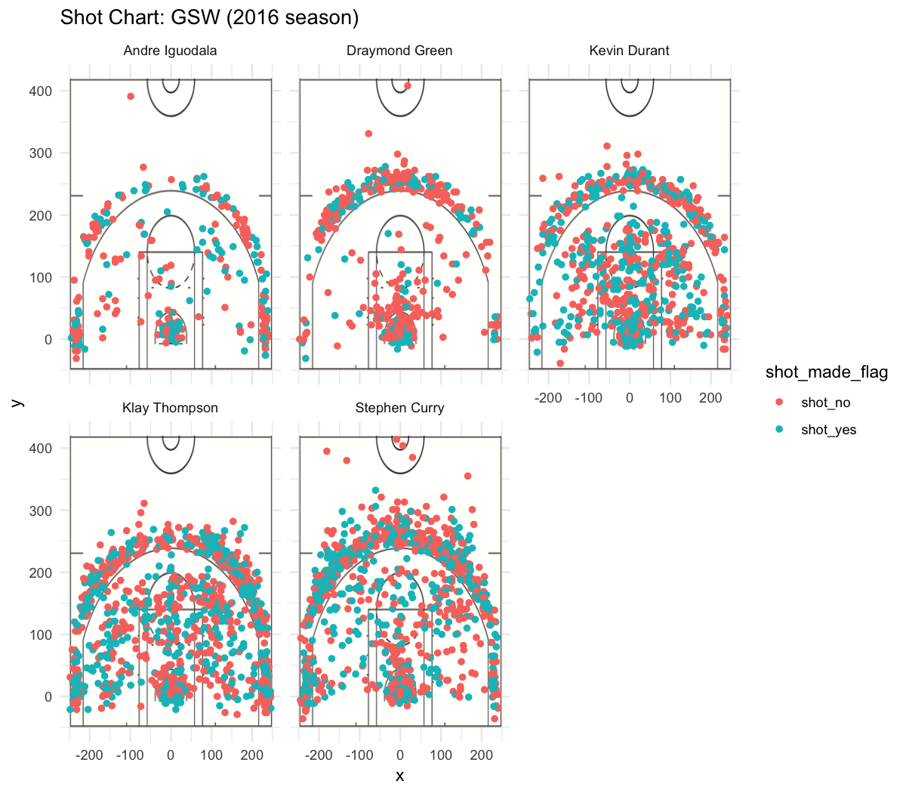

```{r message=FALSE}
library(dplyr)
```


##They have done it again!
For the Golden State Warriors, there is no meaning to the word impossible. Yet another basketball season has gone by and the Golden State Warrior's are still shooting the best in NBA history, bringing statistical impossibilities right into reality. Although the Golden State Warriors have not dominated the basketball courts as much as they have in the years past, they still gave their opponents a run for their money and at one point even won **seven** straight games in a row despite the absence of offensive player Stephen Curry for three of those games and defensive player Draymond Green for two of those three games. But the real **MVPs** of this season for the Golden State Warrios would have to be Andre Iguodala, Draymond Green, Kevin Durant, Klay Thompson, and Stephen Curry. Here is the shot charts of each player to get a sense of just how well these five players did this basketball season.  \  

##Warrior Basics:
```{r out.width='80%', echo = FALSE, fig.align='center'}

```

##The Context:
It is a no brainer that these Golden State Warriors can shoot. The team is even on pace to be the fourth team in the last **twenty years** to make more than half of their shots. We should also consider the value of 3-pointer shots. Making more than half of those shots would mean that the Golden State Warriors shots are more valuable than any of the 1,483 other teams that played in their league! The Warriors have the highest mark in offensive efficiency in NBA history and from every area of the floor, the Golden State Warriors have shot better than they did last season. From the Shot Charts of the five Warriors above we are seeing their biggest increase of shots made from mid-range (between the paint and the 3-point line). It is interesting to see that for years, analytics have suggested that teams should take less mid-range jumpers as it is the most difficult shot to make and from this many NBA teams are learning to take less mid-range jumpers. Today teams are averaging around 16 mid-range jumpers per game but the Golden State Warriors are instead averaging 20 and using this to their advantage. There is the question of whether or not this mid-range usage is the cause for their success or if the Golden State Warriors are just that talented that they can succeed despite the less-than-optimal shot selection given by analytics.   \  

##The Data:
```{r, echo=FALSE, comment=""}
data <- read.csv(file = "../data/shots-data.csv", header = TRUE)
player_two <- group_by(data, name)
player_two <- arrange(dplyr::summarise(player_two, total = sum(shot_type == "2PT Field Goal"), made = sum(shot_type == "2PT Field Goal" & shot_made_flag == "shot_yes"), perc_made = made/total), desc(perc_made))
player_three <- group_by(data, name)
player_three <- arrange(dplyr::summarise(player_three, total = sum(shot_type == "3PT Field Goal"), made = sum(shot_type == "3PT Field Goal" & shot_made_flag == "shot_yes"), perc_made = made/total), desc(perc_made))
player_total <- group_by(data, name)
player_total <- arrange(dplyr::summarise(player_total, total = sum(shot_type == "2PT Field Goal" | shot_type == "3PT Field Goal"), made = sum((shot_type == "2PT Field Goal" | shot_type == "3PT Field Goal") & shot_made_flag == "shot_yes"), perc_made = made/total), desc(perc_made))
knitr::kable(player_two)
knitr::kable(player_three)
knitr::kable(player_total)
```

##Analysis:
In terms of ranking, Klay Thompson ranks eigth in the league while Curry, Thompson, and Kevin Durant are three of the nine players who have shot 50 percent or better on at least 50. Loooking at the data above we can see that all five of these players have made at least or even higher than 50 percent of two point field goals. Even for three point field goals the players average around an impressive mid 30-40 percent range. Comparing to last season, Andre Iguodala, Stephen Curry and Kevin Durant actually have seen a drop in effective field goal percentage from last season while Klay Thompson and Draymond Green have seen an increase in effective field goal percentage. The players really going to work this season are not suprisingly Golden State Warrior players Stephen Curry, Klay Thompson and Kevin Durant all players who have taken just about **one thousand** shots this season each. Yet we can't forget about the other two star players who have been doing just as well despite not shooting as much. Andre Iguodala is the Golden State Warrior's go to player for shooting two point field goals with the highest average percentage for making shots at an astonishing 64 percent and hopefully we will soon see this player rise in the seasons to come. It is also amazing to see how well player Draymond Green has done this season despite shoulder problems, still able to get an efffective shooting percentage around 42 percent. The real star this season would have to be Kevin Durant who's statistics have skyrocketed to 54 percent, higher than even his supserstar counterpart Stephen Curry. Over the past few games that Curry missed due to his ankle injury Kevin Durant found a way to dominate the floor and consistenly carry the load in Curry's absence. \  
Shooting is one of, if not the most important aspect of basketball and these three perimeter players have taken more than half (around 53 percent) of the Warriors' shots this season. From looking at the statistics in the table given above, these five players of the Golden State Warriors have found a way to be efficient enough, excellent even from the mid-range point that their opponents must plan a different defense to account for that area on the court. This inevitably will decrease their ability to defend the hoop and 3-point line however, giving the Golden State Warriors a balanced offensive strategy to sweep the floor with their opponents in any circumstance.   \  

##Conclusion:
From what this season has shown us it is obvious that the Warriors are still dominating the game and shows no signs of slowing down. Andre Iguodala, Kevin Durant, Klay Thompson, Draymond Green, and Stephen Curry are the bread and butter of this incredible team with shooting statistics that are off the charts. Despite some injuries to star players Stephen Curry and Draymond Green, the Golden State Warriors were still able to pull off some impressive feats this season and have continued to make their fans proud. You can't just help but to wonder what new impressive feats they are going to pull off in the next years to come when the team is at full strenght. All in all, the Golden State Warriors shoot more effectively than any other team in NBA history and that in itself is a major key to how they are so great as well as how they managed to capture their third championship in the last four years. If they keep this up there are many more championships within their grasp in the years to come.  \  

##References:
* https://on.nba.com/2Vv1t2u
* https://bit.ly/2HcDJMD
* https://bit.ly/2BWTmoc
* https://bit.ly/2EnDkUD
